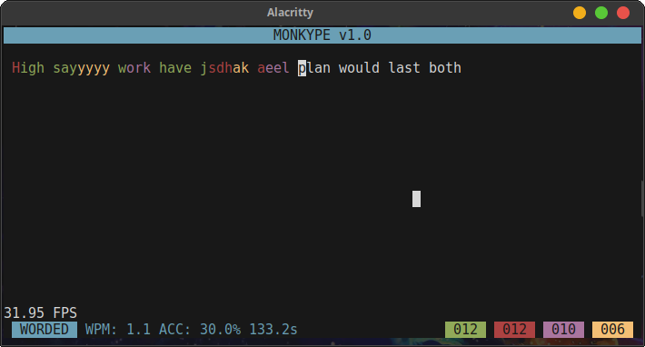

# Monkype

A real-time typing application for the terminal, built entirely in C with `ncurses` library, featuring a minimalist TUI, instant feedback, WPM and accuracy stats, customizable datasets, and responsive input handling. Based on the concept of the popular website [Monkey Type](https://github.com/monkeytypegame/monkeytype/).

<p align="center">  </p>

## Get Started

To install monkype on your device, follow these steps:

**1. Clone this repo**


```bash
git clone --depth 1 https://github.com/Raffa064/monkype.git
cd monkype
```
**2. Run installation script**
```bash
sudo ./install.sh
```
> [!IMPORTANT]
This script will build, and copy monkype executable to your /usr/local/bin folder, which is way it requires sudo

**3. Managing datasets**

After installed, you need use the utility script `monkype-get` to install datasets from original **Monkey Type** repo on github. Datasets are files which contains a set of words to be used by monkype. You can download a dataset for you preferred language as follows:
```bash
monkype-get english
```
Note that, this command is also responsible for select the default dataset for the monkype TUI. 
> [!TIP]
When used without arguments, the `monkype-get` command will show a list of the installed datasets and which of these are currently in use.

To see all available datasets, you can use `monkype-list` command:
```bash
monkype-list portuguese # show all portuguse datasets
```
To remove installed datasets, you can use `monkype-remove` and the name of the dataset to be removed. You can also use `monkype-remove all` to remove all installed datasets:
```
monkype-remove spanish_1k
```
**4. How to play**

To run monkype, it is as easy as typing it's name on the terminal. But the `monkype` command have a lot of options to use, and to checkout them, you can use `-h` option:
```bash
monkype -h
```
And something like this will be shown:
```
Monkype v1.0

Usage:
  monkype [options]

Options:
  -h              Show this help message and exit
  -l              Loop mode (restart after finish)
  -s <seed>       Set RNG seed
  -w <count>      Number of words in session
  -f <fps>        Target frames per second
  -d <file>       Use custom dataset from path
  -D <dataset>    Use installed dataset (default: english)
  --csv <file>    Export session stats to a CSV file (default: ~/.local/share/monkype/stats.csv)
  -p              Print session word list only
```

So here is a example command with 30 words, Italian dataset, at 120 FPS:
```bash 
monkype -w 30 -D italian -f 120
```

**5. Statistics**

Session statistics are saved by default to `~/.local/share/monkype/stats.csv`.  
The file tracks your performance with the following fields:

| Data       | Num. Type | Description                                 |
|------------|-----------|---------------------------------------------|
| timestamp  | int       | Timestamp for when the session finished     |
| dataset    | N/A       | Which dataset was used                      |
| seed       | int       | Seed used to generate the wordset           |
| word_count | double    | Number of words                             |
| wpm        | double    | Words per minute                            |
| accuracy   | double    | Typing accuracy (%)                         |
| time       | double    | Session duration in seconds                 |
| correct    | int       | Correct characters                          |
| incorrect  | int       | Incorrect characters                        |
| missed     | int       | Missing characters                          |
| extra      | int       | Extra characters                            |

> [!TIP]
You can redirect statistics to any file you want with `--csv` option

